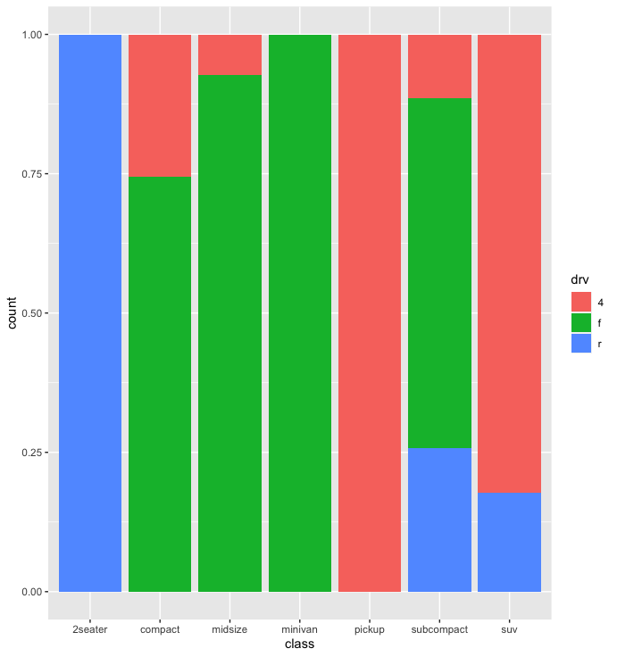

# Barplots with ggplot2
## `g <- ggplot(df, aes(class))`

`g + geom_bar()`

***
`g + geom_bar(aes(fill = drv))`

***
`g + geom_bar(aes(fill = drv), position = "fill")`

***
`g + geom_bar(aes(fill = drv), position = "dodge")`

***