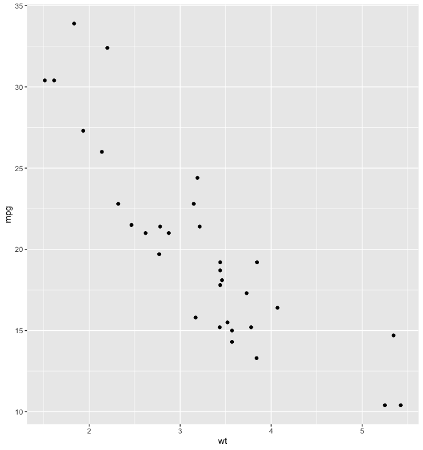
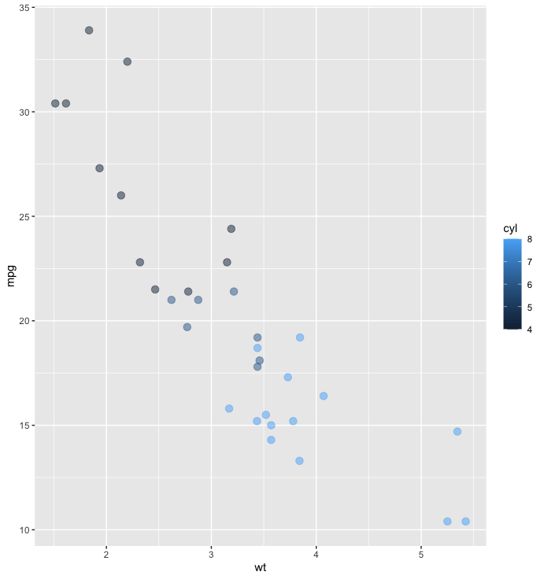
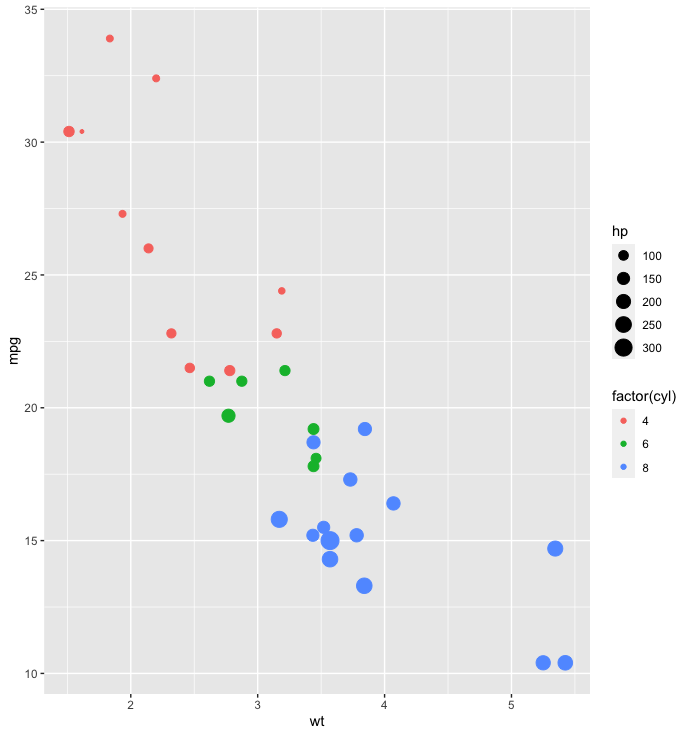
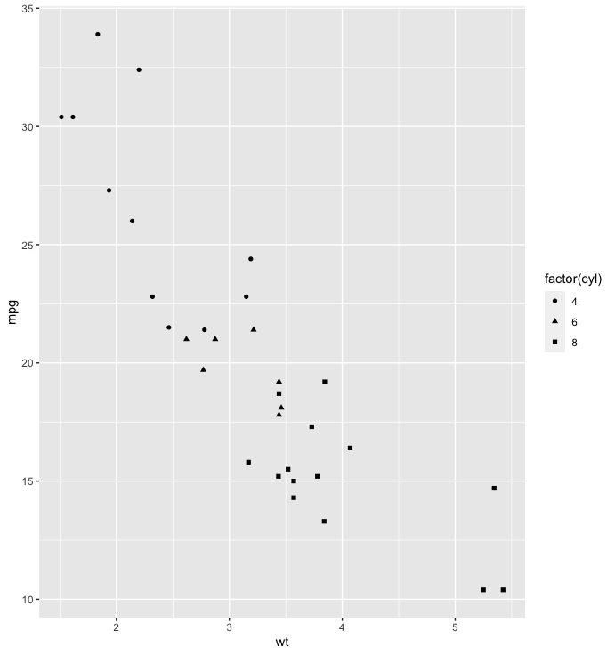
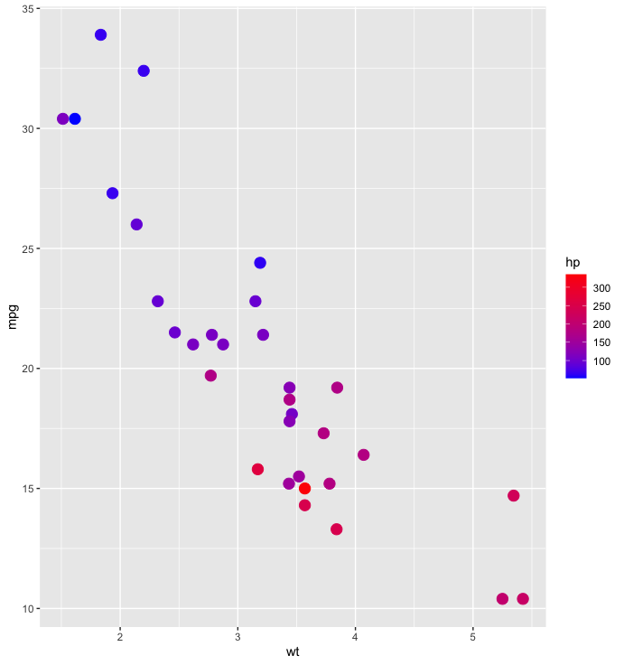

# Scatterplots with ggplot2

Scatter plots allow us to place points that let us see possible correlations between two features of a data set. Let's see how we can create them with ggplot!

## `pl <- ggplot(data=df,aes(x = wt,y=mpg)) `

`pl + geom_point()`

***

`pl + geom_point(aes(color=cyl), alpha= 0.5, size= 3)`

***

`pl + geom_point((aes(size=hp, color=factor(cyl))))`

***

`pl + geom_point(aes(shape=factor(cyl)))`

***

`pl + geom_point(aes(colour = hp),size=4) + scale_colour_gradient(high='red',low = "blue")`

