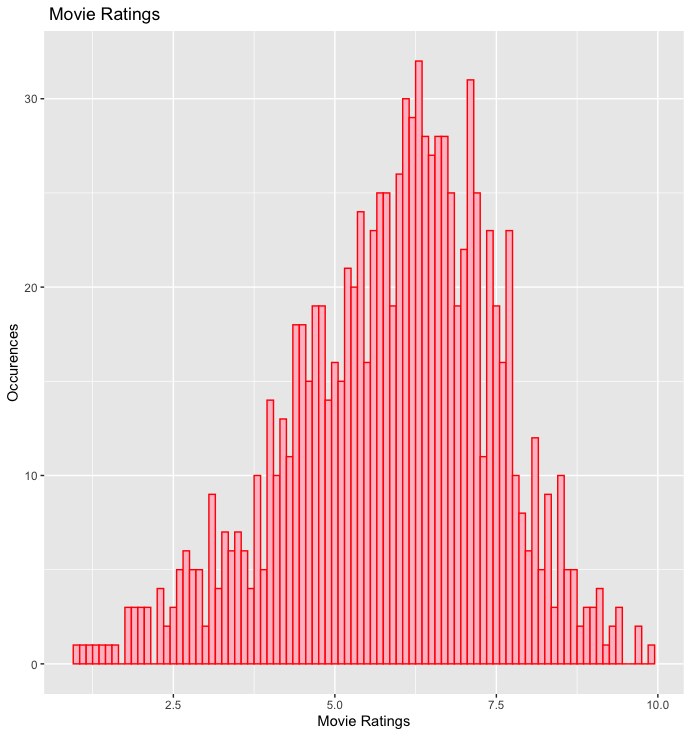

# Histograms with ggplot2

 
`pl<- ggplot(df, aes(x=rating))`

`pl + geom_histogram()`

***

`pl + geom_histogram(binwidth=0.1, color='red', fill='pink', alpha=0.2)`

***

`pl + geom_histogram(binwidth=0.1,color='red',fill='pink') + xlab('Movie Ratings')+ ylab('Occurences') + ggtitle(' Movie Ratings')`

***

`pl  + geom_histogram(binwidth=0.1,fill='blue',alpha=0.4) + xlab('Movie Ratings')+ ylab('Occurences')`

***

`pl + geom_histogram(binwidth=0.1,color='blue',fill='pink',linetype='longdash') + xlab('Movie Ratings')+ ylab('Occurences')`

***

`pl + geom_histogram(binwidth=0.1,aes(fill=..count..)) + xlab('Movie Ratings')+ ylab('Occurences')`

***

`pl2 <- pl + geom_histogram(binwidth=0.1,aes(fill=..count..)) + xlab('Movie Ratings')+ ylab('Occurences')`
`pl2 + scale_fill_gradient('Count',low='blue',high='red')`

